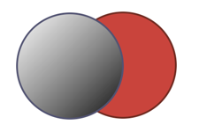
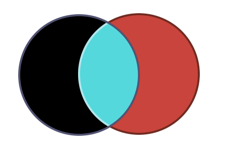

Color effects are used in "fill" and "stroke-fill" properties. When color effect is empty, the corresponding part of the shape is not drawn.

## Filling color effects

This effects are filling the corresponding part of the shape.

| Color effect        | Description             | Sample        |
| :---------------    | :------------           | :------------ |
| AlphaPerlinNoise    | One color perlin noise with transparency |  |
| Color               | Uniform color           |  |
| ConicGradient       | Fill with a conic gradient of two colors |  |
| GradientPerlinNoise | Two colors perlin noise |  |
| LinearGradient      | Fill with a linear gradient of two colors |  |
| PerlinNoise         | Simple perlin noise     |  |
| RadialGradient      | Fill with a radial gradient of two colors |  |

## Transforming color effects

This effects are modifying the color in background.

| Color effect     | Description                | Sample        |
| :--------------- | :------------              | :------------ |
| ColorRotate      | Apply a color rotation     |  |
| GreyLevel        | Transform background to grey levels |  |
| HuePerlinNoise   | Apply a color rotation based on a perlin noise |  |
| Negative         | Inverse background color   |  |
