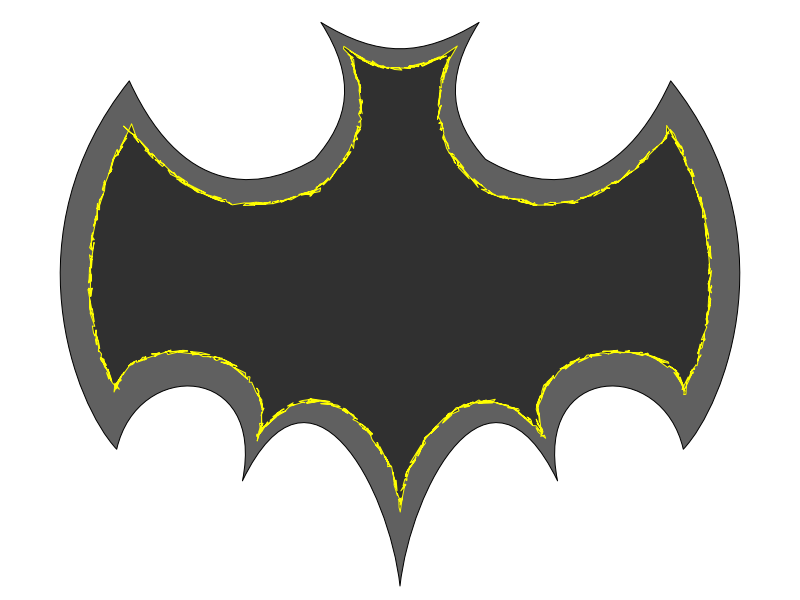

##  Demo gallery

<table class="demos">
  <tbody>
    <tr>
      <td> Flower with bezier curves </td>
      <td> </td>
      <td><a href="/demos/demo-bezier-flower.xvg">download</a></td>
    </tr>
    <tr>
      <td> Perlin noise demo </td>
      <td> </td>
      <td><a href="demos/demo-noise.xvg">download</a></td>
    </tr>
    <tr>
      <td> Factory icon </td>
      <td> </td>
      <td><a href="demos/factory.xvg">download</a></td>
    </tr>
    <tr>
      <td> Bat icon </td>
      <td> </td>
      <td><a href="demos/Bat.xvg">download</a></td>
    </tr>
    <tr>
      <td> Ludigraphix icon </td>
      <td> </td>
      <td><a href="demos/lgx-icon.xvg">download</a></td>
    </tr>
    <tr>
      <td> Mondrian icon </td>
      <td> </td>
      <td><a href="demos/mondrian.xvg">download</a></td>
    </tr>
    <tr>
      <td> Path effects demo </td>
      <td> </td>
      <td><a href="demos/demo-path-effects.xvg">download</a></td>
    </tr>
  </tbody>
</table>


|  | [download](demos/demo-bezier-flower.xvg) |
|  | [download](demos/demo-noise.xvg) |
|  | [download](demos/factory.xvg) |
|  | [download](demos/lgx-icon.xvg) |
|  | [download](demos/mondrian.xvg) |
