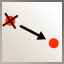

# What is Ludigraphix ?

Ludigraphix is a geometry oriented vector drawing software. This mean that shapes are defined by points that can be shared with other shapes. This allow you to build complex shapes that can be manipulated in a lot of different ways.

Drawings can be saved in a custom format and exported to svg or png files.

# How to get Ludigraphix ?

Ludigraphix is currently available on the [Mac App Store](https://itunes.apple.com/fr/app/ludigraphix/id1376937727)

# Documentation

## Quick start -- the basics

* Create a new document with the create button .
* Every icon inside a square  is an "edition mode" icon. Only one edition mode can be activated at a time.
* To create an object, select one of the edition mode icons : various types of shapes and points can be created in each mode.
* There are three modes that are not used for creating object: 
  - "Select and Move"  &rArr; default edition mode.
  - "Move all"  &rArr; move the drawing and hide points.
  - "Merge into point"  &rArr; used to merge a point with another point.
* Use "Select and Move"  mode to move objects and edit objects properties.
  - Path effects and color effects can be added and modified in the property panel.
* Previous created points can be reused for new shapes, that is the easiest way to link shapes together.
* When creating a point, a currently existing point can be replaced by clicking on it at last creation step.

## List of [all tools availables](tools)

## How to use [color effects](color-effects) ?

## How to use [path effects](path-effects) ?

## Here is [some examples](examples)

# Improvments
This documentation is a work in progress.
  - You can request some documention improvments on [issues page](https://github.com/Ludigraphix/ludigraphix.github.io/issues)
  - You can propose changes on [ludigraphix.github.io project](https://github.com/Ludigraphix/ludigraphix.github.io)

