Path effects can be used in "path-transform" properties. When "path-transform" is empty, no effect is applied to the shape.

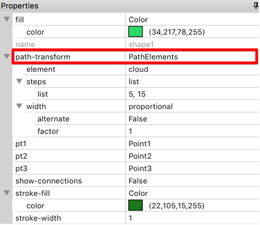

Here is some examples for each effect type. Changing parameters in properties panel can dramatically change the effect.

| Path effect      | Example 1      | Example 2      |
| :--------------- | :------------  | :------------  |
| \<Blank>         | 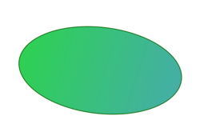 | 
 --- 
 |
| Crenelate        | 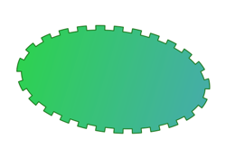 | 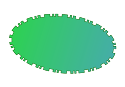 |
| PathElements     | 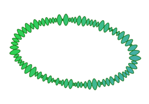 | 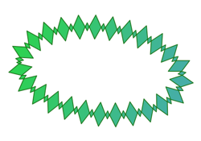 |
| RandomShift      | 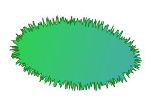 | 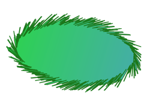 |
| SegmentEffect    | 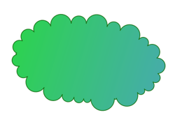 | 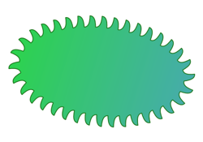 |
| ToStroke         | 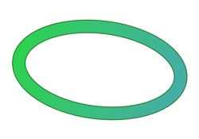 | 
 --- 
 |
| Truchetizer      | 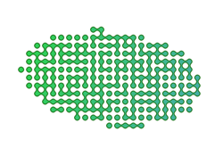 | 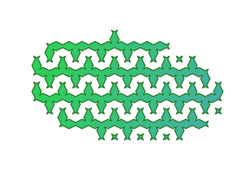 |
