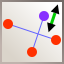
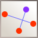

# List of all Ludigraphix tools

### Simple commands

<table class="tools" class="tools">
    <tbody>
        <tr>
            <td width="40">
                
            </td>
            <td>Open an existing document in a new tab.</td>
        </tr>
        <tr>
            <td width="40">
                
            </td>
            <td>Create a new document in a new tab.</td>
        </tr>
        <tr>
            <td width="40">
                
            </td>
            <td>Save current document</td>
        </tr>
        <tr>
            <td width="40">
                
            </td>
            <td>Undo last change</td>
        </tr>
        <tr>
            <td width="40">
                
            </td>
            <td>Roll back last undo</td>
        </tr>
        <tr>
            <td width="40">
                
            </td>
            <td>Unzoom image</td>
        </tr>
        <tr>
            <td width="40">
                
            </td>
            <td>Reset zoom/position</td>
        </tr>
        <tr>
            <td width="40">
                
            </td>
            <td>Zoom image</td>
        </tr>
        <tr>
            <td width="40">
                
            </td>
            <td>Switch off full screen mode, visible only in full screen mode</td>
        </tr>
    </tbody>
</table>

### Simple edition modes

<table class="tools">
    <tbody>
        <tr>
            <td width="40">
                
            </td>
            <td>Select and move objects</td>
        </tr>
        <tr>
            <td width="40">
                
            </td>
            <td>Move the whole drawing</td>
        </tr>
        <tr>
            <td width="40">
                
            </td>
            <td>Merge point into target point</td>
        </tr>
    </tbody>
</table>

### Elementary point creation mode

<table class="tools">
    <tbody>
        <tr>
            <td width="40">
                
            </td>
            <td>Create a new independent point or change an existing point to an independant point</td>
        </tr>
    </tbody>
</table>

### Point creation modes

 - Create or select existing point as reference points then create the point at given position
 - Ratios and angles are chosen during last step
 - You can replace an already existing point at last step
 - You can use &#8984; to force point position to rounded ratio/angle
 - You can keep &#x21E7; pressed at last step to create a sequence of points based on the same references points

<table class="tools">
    <tbody>
        <tr>
            <td width="40">
                
            </td>
            <td>Define a point moving on a line defined by two points</td>
        </tr>
        <tr>
            <td width="40">
                
            </td>
            <td>Define a point by distance and angle</td>
        </tr>
        <tr>
            <td width="40">
                
            </td>
            <td>Define a point by relative coordinates</td>
        </tr>
        <tr>
            <td width="40">
                
            </td>
            <td>Define a point by distance and angle ratio</td>
        </tr>
        <tr>
            <td width="40">
                
            </td>
            <td>Define a point on a bezier curve</td>
        </tr>
    </tbody>
</table>

### Translated points creation modes
 - Create or select existing point as reference points then create the points at given position
 - Distance and angles are chosen during last step
 - You can replace an already existing point at last step
 - you can use &#8984; to force point position to rounded distance/angle
 - you can keep &#x21E7; pressed at last step to create a sequence of points based on the same references points
<table class="tools">
    <tbody>
        <tr>
            <td width="40">
                
            </td>
            <td>Create a point translated by a constant value</td>
        </tr>
        <tr>
            <td width="40">
                
            </td>
            <td>Create a point on a line, distance from the first point is a constant value</td>
        </tr>
        <tr>
            <td width="40">
                
            </td>
            <td>Create a point on the bisector, distance is a constant value</td>
        </tr>
        <tr>
            <td width="40">
                
            </td>
            <td>Create a point on normal, distance is a constant value</td>
        </tr>
    </tbody>
</table>

### Computed points creation modes
 - Create or select existing point as reference point. The generated point is shown during last step.
<table class="tools">
    <tbody>
        <tr>
            <td width="40">
                
            </td>
            <td>Define a point between two given points</td>
        </tr>
        <tr>
            <td width="40">
                
            </td>
            <td>Define the reflection of a target point with respect to a center</td>
        </tr>
        <tr>
            <td width="40">
                
            </td>
            <td>Define the symmetric of a target point with respect to a segment</td>
        </tr>
        <tr>
            <td width="40">
                
            </td>
            <td>Define the orthogonal projection of a target point onto a segment</td>
        </tr>
        <tr>
            <td width="40">
                
            </td>
            <td>Define the projection of a target along an arc</td>
        </tr>
        <tr>
            <td width="40">
                
            </td>
            <td>Translated point by a vector defined by two points</td>
        </tr>
        <tr>
            <td width="40">
                
            </td>
            <td>Intersection of two lines</td>
        </tr>
        <tr>
            <td width="40">
                
            </td>
            <td>Report transformation on ref1/ref2 to pt1/pt2</td>
        </tr>
    </tbody>
</table>

### Shapes, lines and curves creation modes
 - Double click or right-click to finish the shape
<table class="tools">
    <tbody>
        <tr>
            <td width="40">
                
            </td>
            <td>Draw surface delimited by a series of segments</td>
        </tr>
        <tr>
            <td width="40">
                
            </td>
            <td>Draw a series of segments</td>
        </tr>
        <tr>
            <td width="40">
                
            </td>
            <td>Draw surface delimited by a series of bezier curves</td>
        </tr>
        <tr>
            <td width="40">
                
            </td>
            <td>Draw a series of bezier curves</td>
        </tr>
    </tbody>
</table>

### Circles creation modes

 - Create or select existing point as reference point, the generated circle is shown during construction.

<table class="tools">
    <tbody>
        <tr>
            <td width="40">
                
            </td>
            <td>Draw a circle by selecting its center and a point of the circle</td>
        </tr>
        <tr>
            <td width="40">
                
            </td>
            <td>Draw a circle defined by it's diameter</td>
        </tr>
        <tr>
            <td width="40">
                
            </td>
            <td>Draw a circle by creating 3 points</td>
        </tr>
    </tbody>
</table>

### Ellipses creation modes

 - Create or select existing point as reference point, the generated ellipse is shown during construction.

<table class="tools">
    <tbody>
        <tr>
            <td width="40">
                
            </td>
            <td>Draw the smallest Ellipse defined by this three points</td>
        </tr>
        <tr>
            <td width="40">
                
            </td>
            <td>Draw an Ellipse inscribed in a parallelogram defined by its center and the middle of two sides</td>
        </tr>
        <tr>
            <td width="40">
                
            </td>
            <td>Draw an Ellipse inscribed in a parallelogram defined by its axis and the middle of one side</td>
        </tr>
        <tr>
            <td width="40">
                
            </td>
            <td>Draw an Ellipse given its two foci and a point on the ellipse</td>
        </tr>
    </tbody>
</table>

### Squares creation modes

 - Create or select existing point as reference point, the generated square is shown during construction.

<table class="tools">
    <tbody>
        <tr>
            <td width="40">
                
            </td>
            <td>Draw a square by its center and a corner</td>
        </tr>
        <tr>
            <td width="40">
                
            </td>
            <td>Draw a square by its diameter</td>
        </tr>
        <tr>
            <td width="40">
                
            </td>
            <td>Draw a square by two corners of a side of the square</td>
        </tr>
        <tr>
            <td width="40">
                
            </td>
            <td>Draw a square by two points on the axis of the square</td>
        </tr>
    </tbody>
</table>

### Rectangles creation modes

 - Create or select existing point as reference point, the generated rectangle is shown during construction.

<table class="tools">
    <tbody>
        <tr>
            <td width="40">
                
            </td>
            <td>Draw a rectangle by its center and two points on sides</td>
        </tr>
        <tr>
            <td width="40">
                
            </td>
            <td>Draw a rectangle by two points on a side and a point on the opposite side</td>
        </tr>
        <tr>
            <td width="40">
                
            </td>
            <td>Draw a rectangle by two points on opposite sides and a third point</td>
        </tr>
    </tbody>
</table>
